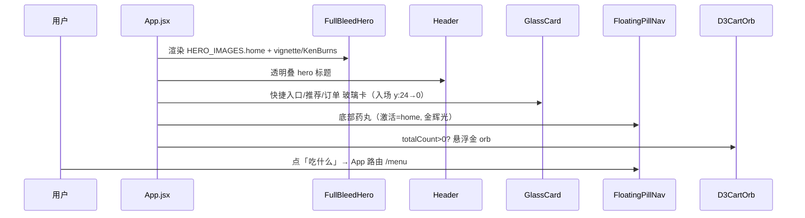
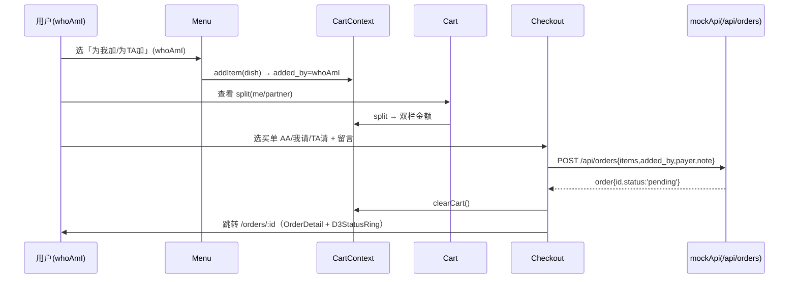
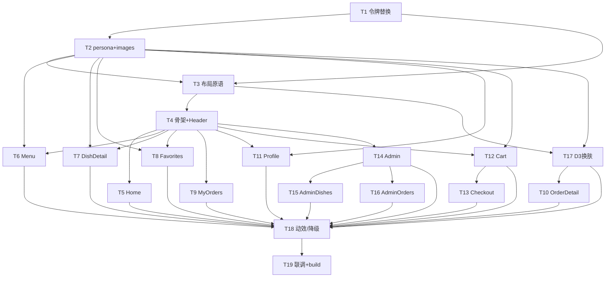

# 架构设计 · 情侣点餐 H5 重排（「暗房晚宴 / Midnight Supper」新视觉语言）

> 架构师：高见远（Gao）｜ 上游：PRD `docs/prd.md` ｜ 基线：`git 5f52c6f`
> 工程路径：`food-ordering-miniapp/`（React 19 + Vite 8 + Tailwind v4 `@theme` + React Router 7 + Framer Motion + localStorage）
> 本文件 = 架构方案 + 文件清单 + 数据结构/接口 + 调用流程 + **有序任务列表（核心交付）** + 依赖 + 共享约定 + 待明确。

---

## 一、实现方案 + 框架选型

### 1.1 技术栈决策（沿用现有栈，不引入新框架）

| 关注点 | 结论 | 理由 |
|---|---|---|
| 框架 | **沿用** React 19 + Vite 8 + React Router 7（懒加载路由） | 主理人裁定沿用；改动仅为视觉层 |
| 样式 | **Tailwind v4 `@theme` 整体替换** | 旧 `@theme`（珊瑚/长春花蓝/奶油）即集中地，替换即换肤 |
| 动效 | **Framer Motion（沿用）** + CSS keyframes | 入场/辉光/Ken Burns；`prefers-reduced-motion` 全关 |
| 3D | **CSS 3D 变换 + Framer Motion（非 WebGL，沿用）** | 主理人裁定：D3 组件仅改材质/颜色/光，不重构逻辑 |
| 后端 | **localStorage + mockApi（完全不动）** | 回归标准：后端不变 |
| 图片 | **菜品卡用既有本地 `public/dish-images/dish-N.webp`；页面 hero/背景用精选 Unsplash 固定 URL + 本地回退** | 决策①；离线严格则回退本地占位 |

**无新增 npm 依赖**（字体走 Google Fonts CDN，决策③）。详见第六节。

### 1.2 令牌替换策略（关键：整体替换且不崩）

直接删除旧 `@theme` 变量名会导致 `var(--color-primary)` 等散落在 12 个页面里的内联引用全部失效、页面开天窗。
采用 **「保留变量名 + 重映射取值 + 新增语义名」** 策略：

- **保留历史变量名，但取值映射到新调色板**：`--color-primary`→金 `#E6B25A`、 `--color-secondary`→冷铂 `#C2C7D2`、`--color-cream`→`ink-900` 底色、`--color-text`→骨白、`--color-cream-dark`→`ink-850`…… 这样**未改写的页面依然可编译、可渲染**（只是自动变成暗底金/铂风），重排可增量、可随时 `git` 回退。
- **新增语义令牌**（Tailwind 工具类自动可用）：`--color-ink-900/850/800`、`--color-bone/ash/mist`、`--color-gold(-soft)`、`--color-platinum(-soft)`、`--color-sage`、`--color-love`、`--color-glass`、`--color-glass-border`、`--radius-card/btn/ctl`、`--font-serif/sans`。
- **重定义共享工具类**（让既有 `className` 自动换肤，降 churn）：
  - `.d3-card-face` → 玻璃卡（ink-800 底座 + `glass` 填充 + 发丝边 + 圆角 28）；
  - `.d3-btn-primary` → 金渐变按钮；`.d3-input` → 暗底玻璃输入；`.d3-badge` → 金柔描边；
  - `.avatar-me`/`avatar-partner` → 金/铂渐变头像（**保留类名**，Cart/Checkout/OrderDetail 直接受益）；
  - `.glow-gold`/`.glow-platinum`/`.glow-sage`/`.glow-love`、`.gradient-text-gold`、`.section-title`（衬线+金下划线）、`.soft-block`（ink-800 玻璃）。

### 1.3 三段式布局原语（形态与落点）

| 原语 | 形态 | 文件 | 说明 |
|---|---|---|---|
| `FullBleedHero` | **React 组件**（含 Framer Motion Ken Burns + vignette overlay） | `src/components/FullBleedHero.jsx`（新建） | 全屏底片层 `object-cover` 美食大图；`variant="immersive"`=暗角，`variant="functional"`=模糊+压暗 40–60% 作背景；`prefers-reduced-motion` 时关 Ken Burns |
| `GlassCard` | **React 组件**（motion 包装，统一入场 y:24→0 + opacity + ease-out≈0.5s） | `src/components/GlassCard.jsx`（新建） | 内容容器；props：`className / delay / as / glow`；等价于「玻璃卡」语义，新分组块用它 |
| `FloatingPillNav` | **React 组件**（取代旧 `TabBar`） | `src/components/FloatingPillNav.jsx`（新建） | 底部居中悬浮玻璃药丸，仅图标 + 激活态金/铂辉光脉冲；读取 `useLocation`；由 `App.jsx` 控制是否在 `/admin*` 隐藏（决策⑨） |

> 旧 `TabBar.jsx` 保留文件但不再被 `App` 引用（可删，建议先留作回退对照）。`D3CartOrb` 悬浮金色 orb 保留，由 `App` 渲染。

---

## 二、文件列表及相对路径

### 2.1 新建文件

| 路径 | 作用 |
|---|---|
| `src/theme/tokens.css` | （可选）将新 `@theme` 单独抽出；本方案直接写入 `index.css`，此文件可不建 |
| `src/theme/persona.js` | **双人格唯一真源**：`PERSONA.me/partner`（color/gradient/glow/chipBg）、`ORDER_STATUS`（pending/preparing/completed 色环）、`PAYER`（AA/我请/TA请 描边色） |
| `src/theme/images.js` | 图片资源中心：`HERO_IMAGES`（各页 hero Unsplash 固定 URL）、`resolveHero(src)`（带本地 `/dish-images` + 渐变三级回退）、webp 参数 |
| `src/theme/motion.js` | 动效工具：`pageVariants`、`cardEntrance(delay)`、`usePrefersReduced()` 封装；统一入场/降级 |
| `src/components/FullBleedHero.jsx` | 全屏底片层原语 |
| `src/components/GlassCard.jsx` | 浮起玻璃卡原语 |
| `src/components/FloatingPillNav.jsx` | 悬浮玻璃药丸导航（取代 TabBar） |

### 2.2 改写文件

| 路径 | 改什么 |
|---|---|
| `src/index.css` | **整体替换 `@theme`**（重映射 + 新语义令牌）；重定义 `.d3-card-face/.d3-btn-primary/.d3-input/.d3-badge/.avatar-me/.avatar-partner/.glow-*/.gradient-text*/.section-title/.soft-block`；字体换 Noto Serif/Sans SC + Playfair/Inter；新增玻璃 `.glass`/降级 `@supports`；精简旧暖点纹理；强化 `reduced-motion` |
| `index.html` | 引入 Google Fonts（`<link rel="preconnect">` + 字体外链）；标题改为「暗房晚宴 · 今天想吃什么」 |
| `src/App.jsx` | `TabBar`→`FloatingPillNav`；环境光晕由珊瑚/蓝径向 → 暖金径向；保留路由与 `D3CartOrb`；`/admin*` 隐藏药丸导航（决策⑨） |
| `src/components/Header.jsx` | 透明叠 hero（玻璃毛玻璃顶栏）；标题改用衬线 `font-serif`；激活色改金/铂；去掉旧奶油渐变底 |
| `src/components/D3CartOrb.jsx` | orb 渐变改金 `#F0CE92→#E6B25A`；数量徽标 `love` 色；辉光金色 |
| `src/components/D3FlipCard.jsx` | 正面=全屏美食图（glass 边），背面=玻璃信息面板（ink 底）；仅材质/光 |
| `src/components/D3StatusRing.jsx` | 色环改 `ORDER_STATUS` 的 gold/platinum/sage；玻璃内盘 ink 底 |
| `src/components/AddDishModal.jsx` | 下滑入场保留；卡片改玻璃；按钮金渐变；分隔线 glass-border |
| `src/components/KissIcon.jsx` | 填充色改 `love` `#E8A6A0`（当前 `currentColor`，调用处传 `text-[var(--color-love)]`） |
| `src/pages/Home.jsx` | 包 `FullBleedHero`；quick actions / 推荐卡改 `GlassCard`；去珊瑚硬编码色；头像 chip 用 PERSONA |
| `src/pages/Menu.jsx` | `FullBleedHero` 随分类切图；`WhoSelector` 用 PERSONA 金/铂；分类 chip 玻璃化、去彩虹渐变；`+1` 粒子金渐变；加购按钮按 `whoAmI` 取 PERSONA 渐变 |
| `src/pages/DishDetail.jsx` | 全屏菜品图作 hero；信息/数量 `GlassCard` 从下滑入；「为我/TA 加」按钮按 `whoAmI` PERSONA 着色 |
| `src/pages/Cart.jsx` | 双栏 `GlassCard`（me=金发丝边 `glass-me` / partner=铂发丝边 `glass-partner`）；`split` 金额；买单入口保留；`IDENTITY_COLORS` 改引用 `PERSONA` |
| `src/pages/Checkout.jsx` | 压暗 hero 背景；买单三药丸按 `PAYER` 取金/铂描边+辉光；摘要 `GlassCard` |
| `src/pages/MyOrders.jsx` | 暗底玻璃列表；行内状态点用 `ORDER_STATUS` 色 |
| `src/pages/OrderDetail.jsx` | 订单大图 `FullBleedHero`；`D3StatusRing` + `GlassCard`；`STATUS_CONFIG` 迁至 `PERSONA.ORDER_STATUS`；归属头像 chip |
| `src/pages/Profile.jsx` | 大头像 hero + 🐱/🐰 身份切换（激活辉光脉冲）；玻璃分组面板 |
| `src/pages/Favorites.jsx` | 沉浸卡片流；角标「我收藏/TA收藏」用 PERSONA 金/铂 |
| `src/pages/Admin.jsx` | 暗底玻璃控台（可读性优先）；统计卡 `GlassCard`；快捷入口玻璃；返回用户端 |
| `src/pages/AdminDishes.jsx` | 玻璃表格卡；上架= sage、编辑= platinum、删除= love/暗红；`AddDishModal` 复用玻璃 |
| `src/pages/AdminOrders.jsx` | 玻璃订单行；状态更新按钮用 `ORDER_STATUS`；归属色 |
| `src/lib/categoryIcons.js` | `getDishImage` 保持不变（仍返回本地 `image_url`）；可加 `resolveHero` 代理（可选） |

> `src/lib/mockApi.js`、`src/lib/favorites.js`、`src/components/CartContext.jsx` **不改**（后端/双人格逻辑零改动）。

---

## 三、数据结构与接口（双人格 × 视觉层映射）

### 3.1 数据模型（保持不变，仅视觉表达）

```
CartContext（不改）
├─ whoAmI: 'me' | 'partner'          // 当前点餐者
├─ items[]: { dish_id, name, price, quantity, added_by: 'me'|'partner' }
├─ split: { me: number, partner: number }   // 按 added_by 累加
└─ setWhoAmI / addItem / removeItem / updateQuantity / clearCart
```
> 视觉层**只读** `whoAmI` / `added_by` / `split`，绝不修改其计算逻辑。

### 3.2 双人格颜色映射表（`src/theme/persona.js` 单一真源）

| 语义 | 我 (me) | TA (partner) |
|---|---|---|
| 强调色 | `--color-gold` `#E6B25A` | `--color-platinum` `#C2C7D2` |
| 高光 | `--color-gold-soft` `#F0CE92` | `--color-platinum-soft` `#DDE0E8` |
| 渐变 | `linear-gradient(135deg,#F0CE92,#E6B25A)` | `linear-gradient(135deg,#DDE0E8,#C2C7D2)` |
| 头像 chip | `.avatar-me`（金边+「我」/🐱） | `.avatar-partner`（铂边+「TA」/🐰） |
| 激活辉光 | `glow-gold` | `glow-platinum` |
| 购物车发丝边 | `glass-me`（金 hairline） | `glass-partner`（铂 hairline） |
| 买单药丸-我请 | 金描边+辉光 | — |
| 买单药丸-TA请 | — | 铂描边+辉光 |
| 大图角标（谁加的） | 金角标 🐱 | 铂角标 🐰 |

### 3.3 订单状态 × 视觉层映射（替代旧 STATUS_CONFIG）

| 状态 | 文案 | 色环/强调 | 来源 |
|---|---|---|---|
| `pending` 待处理 | 等着呢 ⏳ | **platinum** 冷铂 | `ORDER_STATUS.pending` |
| `preparing` 制作中 | 在做了 👨‍🍳 | **gold** 暖金 | `ORDER_STATUS.preparing` |
| `completed` 已完成 | 做好啦 🎉 | **sage** 鼠尾草绿 `#9DB39A` | `ORDER_STATUS.completed` |

> `D3StatusRing` 的 `config.ring` 由 `PERSONA.ORDER_STATUS[status].ring` 提供（两项：底色/主色）。

### 3.4 共享接口签名

```js
// src/theme/persona.js
export const PERSONA = {
  me:      { key:'me',      label:'我', emoji:'🐱', color:'#E6B25A', colorSoft:'#F0CE92',
             gradient:'linear-gradient(135deg,#F0CE92 0%,#E6B25A 100%)',
             glassBorder:'rgba(230,178,90,0.45)',  glow:'0 0 0 3px rgba(230,178,90,0.18),0 6px 20px rgba(230,178,90,0.22)' },
  partner: { key:'partner', label:'TA', emoji:'🐰', color:'#C2C7D2', colorSoft:'#DDE0E8',
             gradient:'linear-gradient(135deg,#DDE0E8 0%,#C2C7D2 100%)',
             glassBorder:'rgba(194,199,210,0.45)', glow:'0 0 0 3px rgba(194,199,210,0.18),0 6px 20px rgba(194,199,210,0.22)' },
}
export const ORDER_STATUS = {
  pending:   { text:'等着呢', emoji:'⏳', ring:['#C2C7D2','#C2C7D2'], chipBg:'rgba(194,199,210,0.14)', chipColor:'#DDE0E8' },
  preparing: { text:'在做了', emoji:'👨‍🍳', ring:['#E6B25A','#F0CE92'], chipBg:'rgba(230,178,90,0.14)',  chipColor:'#F0CE92' },
  completed: { text:'做好啦', emoji:'🎉', ring:['#9DB39A','#9DB39A'], chipBg:'rgba(157,179,154,0.16)', chipColor:'#9DB39A' },
}
export const PAYER = {
  aa:      { label:'AA',   emoji:'✌️', border:'rgba(245,241,234,0.18)', glow:'0 0 0 2px rgba(245,241,234,0.10)' },
  me:      { label:'我请', emoji:'🙋', border:'rgba(230,178,90,0.6)',   glow:'0 0 0 3px rgba(230,178,90,0.20)' },
  partner: { label:'TA请', emoji:'💝', border:'rgba(194,199,210,0.6)',  glow:'0 0 0 3px rgba(194,199,210,0.20)' },
}
export const personaOf = (k) => PERSONA[k] || PERSONA.me

// src/theme/images.js
export const HERO_IMAGES = { home:'https://images.unsplash.com/photo-...?w=1200&q=70&auto=format&fit=crop', menu:'...', profile:'...', favorites:'...', orders:'...', order:'...' }
export function resolveHero(src) { /* 返回 src；组件 onError 依次回退到 /dish-images/dish-{n}.webp → ink 渐变 */ }
```

---

## 四、程序调用流程 / 页面路由

### 4.1 路由（**不调整**，仅换壳）

```
/                → 重定向 /home
/home /menu /dish/:id /cart /checkout /orders /orders/:id
/favorites /profile
/admin /admin/dishes /admin/orders        （/admin* 隐藏 FloatingPillNav，决策⑨）
```
懒加载路由（`React.lazy`）保持；页面间转场保留（统一改成玻璃卡式淡入）。

### 4.2 三段式组合（每页统一语法）

```
<App>
  ├─ (env glow: 暖金径向, 仅装饰)
  ├─ <FullBleedHero variant={immersive|functional} src={HERO_IMAGES.x}>   ← 底片层（z-0）
  ├─ <Header .../>                                                        ← 透明叠 hero（z-40）
  └─ <main z-10>
        <GlassCard> 内容块1 </GlassCard>
        <GlassCard delay> 内容块2 </GlassCard>
        ...
     </main>
  ├─ <FloatingPillNav/>   （/admin* 不渲染）
  └─ <D3CartOrb/>         （totalCount>0 时）
```

### 4.3 关键调用流（Mermaid）

**页面组合（Home 为例）：**


**结算下单流（双人格贯通）：**

> 颜色全程由 `PERSONA`/`ORDER_STATUS` 驱动；`added_by`/`whoAmI`/`split` 逻辑零改动。

---

## 五、有序任务列表（核心交付）

> 采用「**宏观 5 阶段**（满足分组/基础设施优先）+ **细粒度 19 任务**（按依赖排序，工程师逐条执行）」双层。所有任务**只换视觉、不改功能与后端**。

### 5.1 宏观阶段（≤5，便于排期/并行）

| 阶段 | 范围 | 含任务 |
|---|---|---|
| **P1 基础层** | 令牌/资源/原语/骨架 | T1, T2, T3, T4 |
| **P2 沉浸型页面**（7） | 大图主导 + 玻璃卡 | T5, T6, T7, T8, T9, T10, T11 |
| **P3 功能型页面**（5） | 压暗背景 + 玻璃控台 + 双人格/买单 | T12, T13, T14, T15, T16 |
| **P4 D3 换肤 + 全局动效/降级** | 仅材质/光/色 + reduced-motion/blur 降级 | T17, T18 |
| **P5 联调 + build 验证 + 一致性审核** | 回归 + 量化指标 | T19 |

### 5.2 细粒度任务（依赖排序，含文件 / 依赖 / 验收）

| ID | 任务 | 改动文件 | 依赖 | 优先级 | 验收点 |
|---|---|---|---|---|---|
| **T1** | 设计令牌整体替换（@theme + 基础样式 + 字体） | `src/index.css`、`index.html` | — | P0 | `npm run build` 通过；`grep` 旧色 `#FF6B5B/#6C7FE0/#FFF8F2` 在 index.css 中为 0；`bg-ink-900`/`text-bone` 工具可用；字体为 Noto Serif/Sans SC + Playfair/Inter，系统兜底 |
| **T2** | 双人格语义中心 + 图片资源 | `src/theme/persona.js`(新)、`src/theme/images.js`(新)、`src/lib/categoryIcons.js`(可选) | T1 | P0 | `PERSONA.me/partner` 取色正确；`ORDER_STATUS`/`PAYER` 导出；`resolveHero` 返回 Unsplash URL 且 onError 三级回退可用 |
| **T3** | 三段式布局原语 | `src/components/FullBleedHero.jsx`(新)、`GlassCard.jsx`(新)、`FloatingPillNav.jsx`(新) | T1,T2 | P0 | FullBleedHero 出图+暗角+KenBurns(reduce 时关)；GlassCard 入场 y:24→0≈0.5s；FloatingPillNav 4 图标、激活金辉光、由 App 控制隐藏 |
| **T4** | 应用骨架 + Header | `src/App.jsx`、`src/components/Header.jsx` | T3 | P0 | 用户页显示药丸导航、/admin* 隐藏；Header 透明叠 hero、衬线标题；环境光晕为暖金；build 通过 |
| **T5** | Home 重排（沉浸式） | `src/pages/Home.jsx` | T4 | P0 | 全屏 hero + 玻璃 CTA + 头像 chip 金/铂；去硬编码珊瑚色 |
| **T6** | Menu 重排（沉浸式 + WhoSelector） | `src/pages/Menu.jsx` | T4,T2 | P0 | 分类切 hero 图；`WhoSelector` 用 PERSONA；分类 chip 玻璃化去彩虹；加购按钮按 `whoAmI` 取 PERSONA 渐变；`+1` 粒子金渐变 |
| **T7** | DishDetail 重排（沉浸式 + 加购归属） | `src/pages/DishDetail.jsx` | T4,T2 | P0 | 全屏菜品图作 hero；信息/数量 GlassCard 下滑入；「为我/TA 加」按钮按 `whoAmI` 着色 |
| **T8** | Favorites 重排（沉浸卡片流） | `src/pages/Favorites.jsx` | T4,T2 | P0 | 卡片流沉浸；角标「我收藏/TA收藏」用 PERSONA 金/铂 |
| **T9** | MyOrders 重排 | `src/pages/MyOrders.jsx` | T4 | P0 | 暗底玻璃列表；行内状态点用 `ORDER_STATUS` 色 |
| **T10** | OrderDetail 重排（沉浸式 + D3StatusRing） | `src/pages/OrderDetail.jsx` | T4,T2,T17 | P0 | 订单大图 FullBleedHero；`D3StatusRing`+GlassCard；`STATUS_CONFIG`→`PERSONA.ORDER_STATUS`；归属头像 chip |
| **T11** | Profile 重排（沉浸式 + 身份切换） | `src/pages/Profile.jsx` | T4,T2 | P0 | 大头像 hero；🐱/🐰 切换 `whoAmI`，激活辉光脉冲；玻璃分组面板 |
| **T12** | Cart 重排（功能型 + 双栏拆分） | `src/pages/Cart.jsx` | T4,T2 | P0 | 双栏 GlassCard（me=金边 `glass-me`/partner=铂边 `glass-partner`）；`split` 金额；`IDENTITY_COLORS`→`PERSONA`；买单入口保留 |
| **T13** | Checkout 重排（功能型 + 买单三药丸） | `src/pages/Checkout.jsx` | T12,T2 | P0 | 压暗 hero 背景；AA/我请/TA请 药丸按 `PAYER` 描边+辉光；摘要 GlassCard；下单流不变 |
| **T14** | Admin 重排（功能型，可读性优先） | `src/pages/Admin.jsx` | T4 | P0 | 暗底玻璃控台、令牌一致；统计卡 GlassCard；快捷入口玻璃；返回用户端；**不强行全屏大图** |
| **T15** | AdminDishes 重排 | `src/pages/AdminDishes.jsx` | T4,T14 | P0 | 玻璃表格卡；上架=sage、编辑=platinum、删除=love/暗红；`AddDishModal` 玻璃复用 |
| **T16** | AdminOrders 重排 | `src/pages/AdminOrders.jsx` | T14,T2 | P0 | 玻璃订单行；状态更新按钮用 `ORDER_STATUS`；归属色 |
| **T17** | D3 组件换肤（仅材质/光/色） | `D3CartOrb.jsx`、`D3FlipCard.jsx`、`D3StatusRing.jsx`、`AddDishModal.jsx`、`KissIcon.jsx` | T2,T3 | P0 | orb 金渐变；FlipCard 正面全图/背面玻璃；StatusRing 用 `ORDER_STATUS` 色；Modal 玻璃下滑；Kiss 改 `love`；3D 逻辑不变 |
| **T18** | 全局动效 / 降级 / 一致性收尾 | `src/index.css`、`src/theme/motion.js`(新) | T5…T17 | P0 | `prefers-reduced-motion` 关全部 transform/animation（含 KenBurns/辉光）；低配 `backdrop-blur`→实底半透明（`@supports` 回退）；全 `src` 旧色 0 残留；12/12 页视觉一致 |
| **T19** | 联调 + build 验证 + 审核 | 运行 `npm run build`/`lint`；产出回归报告 | T18 | P0 | 12 页全可用、0 功能削减；localStorage 后端不变；LCP≤2.5s（首屏大图 webp/响应式）；量化指标达成（PRD 成功标准） |

### 5.3 任务依赖图



---

## 六、依赖包列表

**无新增 npm 依赖。** 现有栈（React 19 / Vite 8 / Tailwind v4 / React Router 7 / Framer Motion 12）完全满足。

仅 **非 npm** 资源：
- **Google Fonts CDN**（决策③）：Noto Serif SC、Noto Sans SC、Playfair Display、Inter；`index.html` 加 `<link rel="preconnect" href="https://fonts.googleapis.com">` + 字体外链；CSS `font-family` 系统兜底（PingFang SC / 微软雅黑），离线不报错。
- **图片**：菜品卡沿用本地 `public/dish-images/*.webp`；hero/背景用 Unsplash 固定 URL（决策①，标注替换点，离线回退本地）。

---

## 七、共享约定（跨文件）

1. **CSS 变量命名**
   - 历史名（重映射，向后兼容既有内联 `var(--color-*)`）：`--color-primary`=金、`--color-secondary`=铂、`--color-cream`=ink-900 底、`--color-cream-dark`=ink-850、`--color-text`=骨白、`--color-text-secondary`=ash、`--color-text-tertiary`=mist、`--color-border`=glass-border、`--color-primary-gradient`=金渐变。
   - 新增语义名（推荐新代码使用）：`--color-ink-900/850/800`、`--color-bone/ash/mist`、`--color-gold/gold-soft/platinum/platinum-soft/sage/love`、`--color-glass/glass-border`、`--radius-card(28px)/btn(16px)/ctl(12px)`、`--font-serif/sans`。
2. **玻璃卡类名**
   - 复用 `.d3-card-face`（已重定义为玻璃卡）；新代码统一用 `<GlassCard>` 组件。
   - 双人格玻璃：`glass-me`（金发丝边+金 tint）/ `glass-partner`（铂发丝边+铂 tint）；降级：`.glass` 在 `@supports not (backdrop-filter)` 时退为 `rgba(30,26,21,0.82)` 实底。
3. **头像 chip 用法**
   - 保留 `.avatar-me`（金）/`.avatar-partner`（铂）；激活态加 `.is-active` → `glow-gold`/`glow-platinum` 辉光脉冲；新代码优先 `import { PERSONA }`，用 `PERSONA[k].chipBg` 渲染，避免硬编码。
4. **金/铂语义常量位置（单一真源）**
   - 全部集中在 `src/theme/persona.js`：`PERSONA` / `ORDER_STATUS` / `PAYER` / `personaOf()`。**禁止**在页面里再写 `#E6B25A`/`#C2C7D2` 等字面量；统一从 `persona.js` 取。
5. **图片**
   - hero/背景统一经 `src/theme/images.js` 的 `HERO_IMAGES` / `resolveHero()`；组件内 `` 三级回退（Unsplash → 本地 `/dish-images` → ink 渐变占位）。
6. **动效**
   - 入场统一 `GlassCard`（y:24→0 + opacity + ease-out≈0.5s）；页面转场用 `src/theme/motion.js` 的 `pageVariants`；所有动画用 `usePrefersReduced()`（封装 `useReducedMotion`）或依赖全局 CSS `@media (prefers-reduced-motion: reduce)` 兜底关闭。

---

## 八、待明确事项（在已裁定 10 项之外，仅作记录/假设，不阻塞）

1. **Hero Unsplash 具体 photo ID**：决策①已锁定「精选远程大图 + 替换点标注」，本方案在 `images.js` 提供 `HERO_IMAGES` 占位 URL（带 webp/响应式参数），**交付前需工程师核对可达性并替换为最终素材**；离线场景已具备本地回退。
2. **分类色（Menu / AdminDishes）**：旧版为彩虹分类色。本方案建议**去彩虹、改为 ink/gold 克制表达**以契合新语言；若主理人希望保留分类色作为信息区分，请告知，我将把 `CATEGORY_CONFIG` 收敛为一组低饱和墨调+金/铂点缀。
3. **Admin 内部导航**：决策⑨仅要求后台隐藏底部悬浮药丸、改用顶栏返回+内部导航。本方案 Admin 三页间通过 `Header` 返回 + 页内入口互链；如需独立侧栏/面包屑可后续补充（不在 v1 必做）。
4. **「轻晚餐」浅色变体（P1-4）/ 价格衬线 tabular-nums（P1-5）**：列为 P1 锦上添花，本方案令牌已预留反相能力（`bone`/`ink` 互为负片），可在 v1 后追加。

---

## 附：新 `@theme` 替换示例（供 T1 直接落地）

```css
/* src/index.css —— 仅示意核心片段，T1 实际落地请覆盖旧 @theme 与工具类 */
@import url('https://fonts.googleapis.com/css2?family=Playfair+Display:wght@500;600;700&family=Noto+Serif+SC:wght@500;600;700&family=Noto+Sans+SC:wght@400;500;700&family=Inter:wght@400;500;600;700&display=swap');
@import "tailwindcss";

@theme {
  /* 表面/底（暖调近黑） */
  --color-ink-900: #0E0C0A;  --color-ink-850: #16130F;  --color-ink-800: #1E1A15;
  /* 文字 */
  --color-bone: #F5F1EA;  --color-ash: #A89F92;  --color-mist: #6E665C;
  /* 双人格强调（温度对比） */
  --color-gold: #E6B25A;  --color-gold-soft: #F0CE92;
  --color-platinum: #C2C7D2;  --color-platinum-soft: #DDE0E8;
  /* 状态 */
  --color-sage: #9DB39A;  --color-love: #E8A6A0;
  /* 玻璃 */
  --color-glass: rgba(245,241,234,0.06);  --color-glass-border: rgba(245,241,234,0.12);
  /* 渐变（品牌金） */
  --color-gold-gradient: linear-gradient(135deg,#F0CE92 0%,#E6B25A 100%);
  /* 圆角语义 */
  --radius-card: 28px;  --radius-btn: 16px;  --radius-ctl: 12px;
  /* 字体 */
  --font-serif: "Playfair Display","Noto Serif SC",serif;
  --font-sans: "Inter","Noto Sans SC","PingFang SC","Microsoft YaHei",sans-serif;

  /* —— 历史名重映射（向后兼容既有 var() 引用） —— */
  --color-primary: #E6B25A;        --color-primary-light: rgba(230,178,90,0.14);
  --color-primary-dark: #B8863C;   --color-peach: #F0CE92;
  --color-secondary: #C2C7D2;      --color-secondary-light: rgba(194,199,210,0.14);
  --color-haze: #C2C7D2;
  --color-cream: #0E0C0A;          --color-cream-dark: #16130F;
  --color-card: #1E1A15;           --color-surface: #1E1A15;
  --color-text: #F5F1EA;           --color-text-secondary: #A89F92;  --color-text-tertiary: #6E665C;
  --color-border: rgba(245,241,234,0.12);
  --color-success: #9DB39A;        --color-warning: #E6B25A;  --color-info: #C2C7D2;
  --color-primary-gradient: linear-gradient(135deg,#F0CE92 0%,#E6B25A 100%);
}
```
